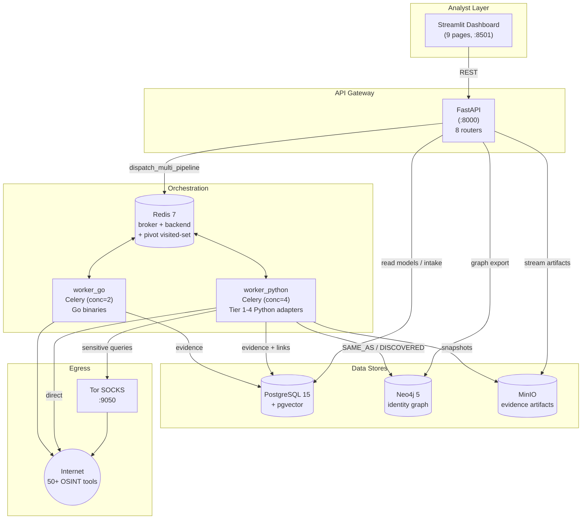
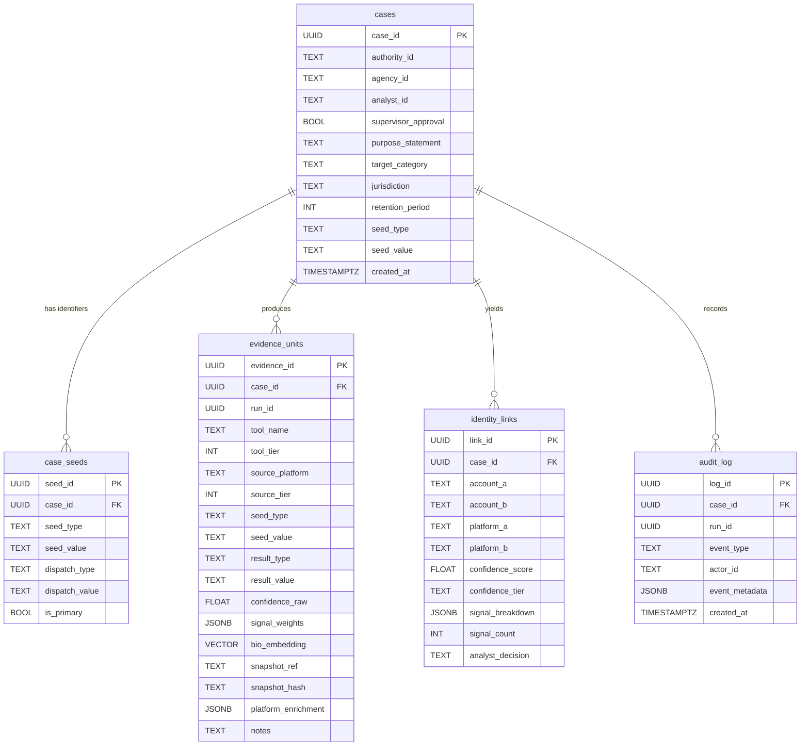
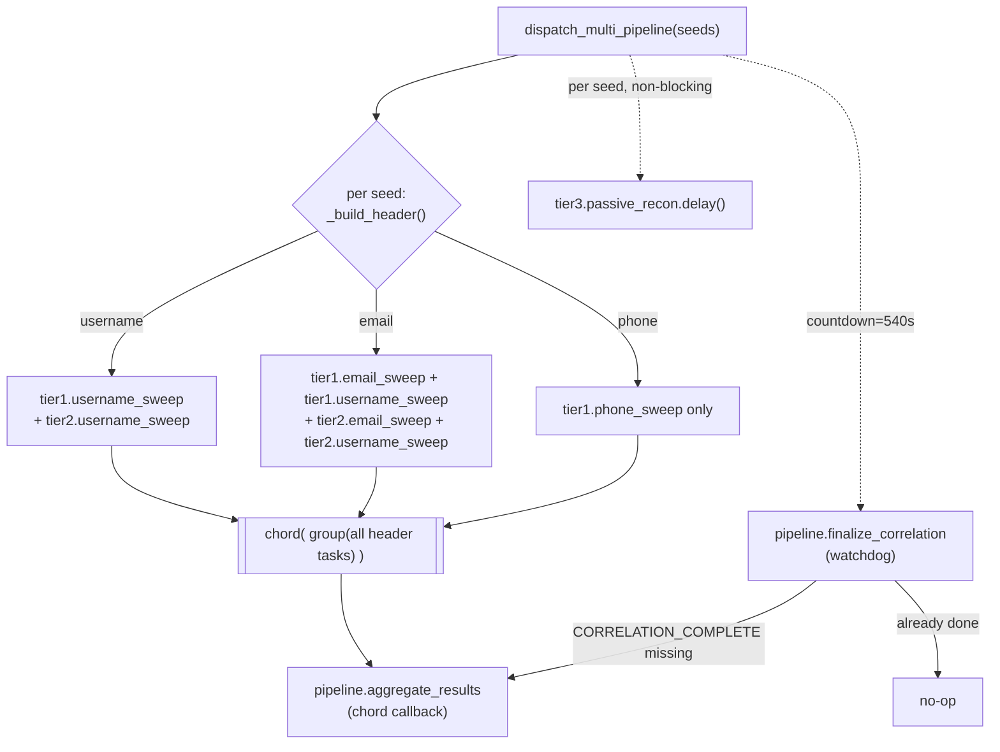

# SOCMINT — Suspect Profiling System · Architecture Reference

> **SOCMINT** (Social Media Intelligence) is a lawful, auditable OSINT pipeline that takes a single
> seed identifier about a subject (a username, email, phone number, or profile URL) and autonomously
> **discovers → correlates → preserves → reports** their cross‑platform digital footprint. It fuses
> 50+ OSINT tools, a weighted‑signal correlation model, recursive cross‑tool pivoting, identity‑cluster
> resolution, and forensic evidence preservation into one investigator‑facing system.

This document is the authoritative engineering reference for the system. It is **backend‑ and
logic‑heavy by design**: the orchestration, the scoring engines, and the data model are documented in
full; the frontend is summarised.

---

## Table of Contents

1. [System Overview](#1-system-overview)
2. [Technology Stack](#2-technology-stack)
3. [High‑Level Architecture](#3-high-level-architecture)
4. [Data Architecture](#4-data-architecture)
5. [API Gateway (FastAPI)](#5-api-gateway-fastapi)
6. [The Processing Pipeline (Celery Orchestration)](#6-the-processing-pipeline-celery-orchestration)
7. [Core Logic Engines](#7-core-logic-engines)
8. [OSINT Tool Adapters](#8-osint-tool-adapters)
9. [End‑to‑End Data Flow](#9-end-to-end-data-flow)
10. [Frontend (Analyst Dashboard)](#10-frontend-analyst-dashboard)
11. [Deployment & Infrastructure](#11-deployment--infrastructure)
12. [Security Posture](#12-security-posture)
13. [Configuration Reference](#13-configuration-reference)
14. [Glossary](#14-glossary)

---

## 1. System Overview

### 1.1 Mission

Given **one or more identifiers** for a single subject, SOCMINT produces a court‑defensible
intelligence package:

- **Discover** — sweep the subject across 700+ platforms and dozens of data sources.
- **Correlate** — decide which discovered accounts belong to the *same* human, with explainable,
  weighted confidence.
- **Preserve** — capture forensic snapshots (HTML + Wayback + hashes) of every confirmed finding.
- **Report** — emit a signed evidence bundle (JSON + PDF + SHA‑256 manifest) plus an investigator
  dossier (inferred attributes, behavioural fingerprint, risk assessment, leads).

### 1.2 Design Principles

| Principle | How it manifests |
|---|---|
| **Legal gate first** | No collection starts until 10 mandatory authorisation fields validate. |
| **Provenance on everything** | Every finding is an `EvidenceUnit` with tool, version, tier, timestamp, snapshot hash, and analyst id. |
| **Append‑only audit** | `audit_log` is insert‑only; the app never issues `UPDATE`/`DELETE` against it. |
| **Explainable scoring** | Correlation/persona scores ship a per‑signal `signal_breakdown`; nothing is a black box. |
| **2‑signal corroboration rule** | A single signal can never assert an identity link — at least two independent signals are required. |
| **Graceful degradation** | A crashing/blocked tool records an `unavailable`/`blocked` marker and never aborts the run. |
| **Bounded everything** | Pivot depth/breadth, preservation per tool, enrichment counts, and wire payloads are all capped. |
| **Pure, testable cores** | Correlation, insight, profile, and persona engines operate on plain dict rows — no DB/network in the hot path — so they are unit‑testable with DTO fixtures. |

### 1.3 The Four Tiers + the Brain

The pipeline runs tools in four tiers and then closes the loop with a recursive **pivot** stage:

- **Tier 1 — Fast sweep**: lightweight username/email/phone existence checks.
- **Tier 2 — Deep sweep**: heavyweight username/email tools (Sherlock, Maigret, holehe, GHunt, …).
- **Tier 3 — Passive recon**: Tor‑routed search‑engine dorking + archive/paste sweeps (off the critical path).
- **Tier 4 — Triggered enrichment**: per‑platform profile scraping + domain recon, fired *after* correlation finds confirmed accounts.
- **Pivot Engine** — extracts new identifiers from collected evidence and re‑seeds them, hop after hop, bounded by depth/breadth/total caps. *This is what makes the system behave like a brain instead of a star.*

---

## 2. Technology Stack

| Layer | Technology | Role |
|---|---|---|
| API gateway | **FastAPI** + Uvicorn | REST surface, case intake, read models |
| Task queue | **Celery 5** + **Redis 7** | Distributed orchestration (broker + result backend) |
| Relational store | **PostgreSQL 15** + **pgvector** | Cases, evidence, links, audit + 384‑dim bio embeddings |
| Graph store | **Neo4j 5 Community** | Identity graph (`Account`, `SAME_AS`, `DISCOVERED`, …) |
| Object store | **MinIO** (S3‑compatible) | Preserved snapshots, screenshots, signed report bundles |
| Anonymised egress | **Tor** SOCKS proxy sidecar | Routes high‑block‑risk Tier 3 / dork traffic |
| Python worker | Celery worker, concurrency 4 | Python OSINT adapters (Tiers 1‑4) |
| Go worker | Celery worker, concurrency 2 | Compiled Go OSINT binaries (Enola, DetectDee, …) |
| Dashboard | **Streamlit** | 9‑page analyst UI |
| ML | sentence‑transformers (`all-MiniLM-L6-v2`), imagehash, python‑Levenshtein | Bio similarity, perceptual photo hashing, fuzzy handle matching |

All services are containerised and orchestrated by [docker-compose.yml](docker-compose.yml).

---

## 3. High‑Level Architecture



### Service inventory (9 containers)

| Service | Port(s) | Purpose | Reload behaviour |
|---|---|---|---|
| `api` | 8000 | FastAPI gateway | **No `--reload`** — restart after editing any `api/` file |
| `dashboard` | 8501 | Streamlit UI | Pages hot‑reload; shared `socmint_ui.py` is cached → restart after editing it |
| `worker_python` | — | Python adapters, Tiers 1‑4, pipeline orchestration | Restart after editing `worker_python/*.py` |
| `worker_go` | — | Go OSINT binaries; publishes them to a shared volume | — |
| `postgres` | 5432 | Relational store (schema auto‑loaded on init) | — |
| `neo4j` | 7474 (UI), 7687 (Bolt) | Identity graph | — |
| `redis` | 6379 | Celery broker/backend + pivot Redis sets | — |
| `minio` | 9000 (API), 9001 (console) | Object storage | — |
| `tor` | 9050 (internal) | Anonymised egress sidecar | — |

---

## 4. Data Architecture

The relational schema is defined in [api/db/schema.sql](api/db/schema.sql) and auto‑loaded into
PostgreSQL on first container init. Two extensions are required: `vector` (pgvector, for bio
embeddings) and `pgcrypto` (`gen_random_uuid()`).

### 4.1 PostgreSQL Schema



#### Table notes

- **`cases`** — One row per investigation. Holds the 10 legal‑gate authorisation fields plus the
  denormalised *primary* seed (for backward compatibility).
- **`case_seeds`** — The full multi‑identifier set supplied at intake. `seed_type/seed_value` is the
  *as‑supplied* normalised identifier; `dispatch_type/dispatch_value` is what the pipeline actually ran
  (e.g. a `profile_url` is resolved to a `username` sweep on the extracted handle). `UNIQUE (case_id,
  seed_type, seed_value)`.
- **`evidence_units`** — The atomic provenance record. The **dedup key** is
  `UNIQUE (case_id, source_platform, result_value, seed_value)`, mirrored by `uq_evidence_dedup` for
  `ON CONFLICT` upserts. `tool_tier ∈ {1,2,3,4}` (1=fast, 2=deep, 3=passive, 4=triggered); `source_tier
  ∈ {1,2,3,4}` (1=API, 2=public web, 3=archive, 4=inferred). `bio_embedding vector(384)` powers
  semantic bio similarity. Indexed on `(case_id, tool_tier)` and `(source_platform, result_value)`.
- **`identity_links`** — One row per scored cross‑platform pair. `confidence_tier ∈ {HIGH, MEDIUM, LOW,
  DISCARD}`; `signal_breakdown` is the explainable per‑signal JSON. `analyst_decision ∈ {CONFIRMED,
  REJECTED, FLAG_UNCERTAIN}` after review.
- **`audit_log`** — **Append‑only.** Records lifecycle events (`CASE_CREATED`, `CORRELATION_COMPLETE`,
  `PIVOT_CORRELATION_COMPLETE`, `TOOL_SKIPPED`, `CHAIN_EXHAUSTED`, `ANALYST_DECISION`, …). The intended
  DB‑level control is `GRANT INSERT only`.

### 4.2 Neo4j Identity Graph

Written by [api/services/graph_builder.py](api/services/graph_builder.py).

- **Node labels**: `Account`, `Email`, `Username`, `Phone`, `Domain`, `Identifier`.
- **Edge types**: `SAME_AS` (correlation link between accounts), `DISCOVERED` (a tool surfaced a new
  identifier — the cross‑tool "brain" reasoning chain, tagged with `{tool, platform}`), plus the
  planned `LINKED_TO`, `USES`, `HAS_EMAIL`, `OWNS_DOMAIN`, `LINKED_PHONE`, `REUSES_CRED`.
- HIGH/MEDIUM correlation links are mirrored into Neo4j via `MERGE (a:Account)-[:SAME_AS]->(b:Account)`
  carrying the score, tier, signal breakdown, and count.

### 4.3 MinIO Object Layout

```
socmint-evidence/                       (bucket; ensured idempotently at startup)
└── cases/
    └── {case_id}/
        ├── {evidence_id}/
        │   ├── screenshot.png           # preserved visual capture (image/png)
        │   └── snapshot.html            # preserved page (text/html or octet-stream)
        └── reports/
            ├── {case_id}_report.json    # signed JSON evidence package
            ├── {case_id}_report.pdf     # PDF report
            └── {case_id}_bundle.sha256  # SHA-256(json_bytes + pdf_bytes)
```

### 4.4 Redis Usage

1. **Celery broker + result backend** (`redis://redis:6379/0`).
2. **Pivot visited‑set & budget counters** (see [§7.4](#74-pivot-engine--the-correlation-brain)):
   - `socmint:pivot:seen:{case_id}` — a Redis `SET` of `{seed_type}:{value}` keys; `SADD` returns `1`
     only for a *new* member, giving an atomic "claim this seed" primitive across concurrent workers.
   - `socmint:pivot:count:{case_id}` — total seeds dispatched, enforcing `MAX_TOTAL_SEEDS`.
   - Both expire after 24h (`_REDIS_TTL_SECONDS`) so finished cases don't accumulate forever.

---

## 5. API Gateway (FastAPI)

Entry point: [api/main.py](api/main.py). Settings are a cached pydantic‑settings singleton in
[api/config.py](api/config.py) (`get_settings()`), loading every connection string, credential, tool
key, and proxy from the environment / `.env`.

The app registers **8 routers**. DB access is **raw SQL via SQLAlchemy 2.x** (`session.execute(text(sql),
params)`), not the ORM — sessions come from [api/db/postgres.py](api/db/postgres.py) (`session_scope()`
context manager + `get_db()` FastAPI dependency, `pool_pre_ping=True`).

### 5.1 REST Surface

#### Cases — `/api/v1/cases`

| Method | Path | Purpose |
|---|---|---|
| `POST` | `/create` | **Core intake.** Runs the legal gate, normalises & dedupes seeds, persists `cases` + `case_seeds`, audits `CASE_CREATED`, dispatches the multi‑seed pipeline. Returns `{case_id, run_id, status, seed_count}` (201). |
| `GET` | `` (root) | Case picker — all cases newest‑first with evidence/link counts. |
| `GET` | `/{case_id}` | Full case row, or 404. |

#### Pipeline — `/api/v1/pipeline`

| Method | Path | Purpose |
|---|---|---|
| `GET` | `/status/{case_id}` | Per‑tier per‑tool progress (`done`/`skipped`/`pending`), lifecycle state machine, elapsed time. |

#### Evidence — `/api/v1/evidence`

| Method | Path | Purpose |
|---|---|---|
| `GET` | `/{case_id}` | List evidence; filters `tier`, `result_type`, `platform`, `include_unavailable` (default false). |
| `GET` | `/{case_id}/review-queue` | MEDIUM‑tier links awaiting analyst decision, sorted by score desc. |
| `POST` | `/review/{link_id}` | Submit `ReviewDecision`; updates link + audits `ANALYST_DECISION`. |
| `GET` | `/{case_id}/snapshot/{evidence_id}` | Stream preserved snapshot bytes from MinIO. |
| `GET` | `/{case_id}/screenshot/{evidence_id}` | Stream preserved PNG from MinIO. |

#### Graph — `/api/v1`

| Method | Path | Purpose |
|---|---|---|
| `GET` | `/graph/{case_id}` | Plotly‑ready `{nodes, edges}`; params `max_nodes=50`, `include_pivots=true`. |
| `GET` | `/health` | Probes postgres / neo4j / minio → `{status, services}`. |

#### Persona — `/api/v1`

| Method | Path | Purpose |
|---|---|---|
| `GET` | `/persona/{case_id}` | Clusters accounts into personas (see [§7.5](#75-persona-resolver--identity-clustering)). |

#### Insights — `/api/v1/insights`

| Method | Path | Purpose |
|---|---|---|
| `GET` | `/{case_id}` | Ranked intelligence assessment from the Insight Engine. |

#### Reports — `/api/v1/reports`

| Method | Path | Purpose |
|---|---|---|
| `POST` | `/generate/{case_id}` | Build JSON + PDF, sign bundle, store to MinIO; returns `bundle_sha256`. |
| `GET` | `/download/{case_id}/{json\|pdf\|sha256}` | Stream the respective artifact. |
| `GET` | `/status/{case_id}` | Readiness — `{evidence_units, identity_links, ready}`. |

#### Dossier — `/api/v1/dossier`

| Method | Path | Purpose |
|---|---|---|
| `GET` | `/{case_id}` | Consolidated dossier = profile engine + insight engine + persona resolver + a `headline` summary. |

### 5.2 Pydantic Models

- **`CaseCreate`** ([api/models/case.py](api/models/case.py)) — 10 mandatory fields + optional
  `additional_seeds: list[SeedInput]`. Validators: `supervisor_approval` must be `True`,
  `purpose_statement` ≥ 20 chars, `retention_period` ≥ 1. `SeedType = {username, email, phone,
  profile_url}`; `TargetCategory = {cybercrime, fraud, harassment, research}`.
- **`EvidenceUnit`** ([api/models/evidence.py](api/models/evidence.py)) — mirrors the
  `evidence_units` table. `ResultType` is a 12‑value `Literal` (10 positive types + `unavailable` +
  `blocked`). `ToolTier`/`SourceTier` are `Literal[1,2,3,4]`.
- **`IdentityLink`** ([api/models/identity_link.py](api/models/identity_link.py)) — mirrors
  `identity_links`. `ConfidenceTier = {HIGH, MEDIUM, LOW, DISCARD}`; `AnalystDecision = {CONFIRMED,
  REJECTED, FLAG_UNCERTAIN}`.

### 5.3 Pipeline Status State Machine

`/api/v1/pipeline/status/{case_id}` reconstructs progress purely from `evidence_units` + `audit_log`
against a static **`TIER_TOOLS`** registry in [api/routers/pipeline.py](api/routers/pipeline.py):

```python
TIER_TOOLS = {
    1: ["blackbird", "whatsmyname", "zehef", "socialscan", "hashtray", "ignorant"],
    2: ["sherlock", "maigret", "nexfil", "social_analyzer", "tracer", "enola",
        "detectdee", "holehe", "h8mail", "mailcat", "eyes", "mailsleuth",
        "ghunt", "email2whatsapp", "xposedornot", "hudsonrock", "proxynova"],
    3: ["dorks_eye", "dorksint", "waybackurls", "huntpastebin", "forum_sweep"],
    4: ["toutatis", "medor", "snapintel", "telegram_intel", "tiktok_userdata",
        "mastosint", "osintssky", "osintchan", "proton_intel", "linkedin2username",
        "theharvester", "finalrecon", "webdiver", "github_api", "sublist3r", "dnstwist"],
}
```

Per‑tool status:

- **`done`** — ≥1 evidence row with `result_type NOT IN ('unavailable','blocked')`.
- **`skipped`** — only `unavailable`/`blocked` marker rows, or a `TOOL_SKIPPED` audit event ("ran empty").
- **`pending`** — no rows and no markers.

Lifecycle state (30‑second activity window): `running` if the case was created or last produced
evidence ≤ 30 s ago; `complete` if a `CORRELATION_COMPLETE`/`PIVOT_CORRELATION_COMPLETE` event exists
(or hits exist and activity is stale); else `idle`.

---

## 6. The Processing Pipeline (Celery Orchestration)

Orchestration lives in [worker_python/celery_app.py](worker_python/celery_app.py). Celery is configured
with JSON serialization, UTC, and includes the six task modules (`tier1_tasks`, `tier2_tasks`,
`tier3_tasks`, `tier4_tasks`, `pivot_tasks`, `preservation_tasks`).

### 6.1 Dispatch: the chord + watchdog

Case creation calls **`dispatch_multi_pipeline(seeds, case_id, run_id, analyst_id)`**, which unions the
Tier 1/2 header tasks for *every* supplied seed into **one chord** so that a single
`aggregate_results` callback runs correlation exactly once over the complete evidence set (rather than
N racing correlations each seeing a partial picture).



**Header composition** (`_build_header`) is seed‑type aware:

- **email** → `tier1.email_sweep`, `tier1.username_sweep`, `tier2.email_sweep`, `tier2.username_sweep`.
- **phone** → `tier1.phone_sweep` *only* (username tools produce nothing for a raw number and would
  block the worker for minutes).
- **username** (and resolved `profile_url`) → `tier1.username_sweep`, `tier2.username_sweep`.

A flat list (not nested groups) is used because Celery flattens nested single‑task groups unreliably,
which could silently drop a Tier‑1 task from the chord header.

**The watchdog** (`CORRELATION_WATCHDOG_SECONDS`, default **540 s**): the Tier 1/2 chord can
intermittently drop a header task, in which case the chord never reaches its completion count and
`aggregate_results` never fires — so correlation/persona/pivot/enrichment silently never run.
`finalize_correlation` is scheduled at dispatch time with a countdown; it checks `audit_log` for a
`CORRELATION_COMPLETE` event for the run and is a **no‑op on the happy path**, otherwise it runs the
aggregation itself.

### 6.2 Tier → Tool Chains

Tool chains are defined in the `FallbackChainManager` ([worker_python/adapters/fallback_chain.py](worker_python/adapters/fallback_chain.py)):

| Chain | Tools (in order) |
|---|---|
| `username_tier1` | `blackbird`, `whatsmyname` |
| `username_tier2` | `sherlock`, `maigret`, `nexfil`, `social_analyzer`, `tracer`, `enola`, `detectdee`, `hudsonrock`, `proxynova` |
| `email_tier1` | `zehef`, `socialscan`, `hashtray` |
| `email_tier2` | `holehe`, `h8mail`, `mailcat`, `eyes`, `mailsleuth`, `ghunt`, `email2whatsapp`, `xposedornot`, `hudsonrock`, `proxynova` |
| `phone_tier1` | `phone_enrich`, `ignorant`, `phoneinfoga` |
| `passive_recon` (T3) | `dorks_eye`, `dorksint`, `waybackurls`, `hunt_pastebin`, `forum_sweep` |

**Tier 4 trigger matrix** (`platform_map`, fired per confirmed platform after correlation):

| Platform | Tier‑4 adapters |
|---|---|
| instagram | `toutatis`, `medor` |
| snapchat | `snapintel` |
| telegram | `telegram_intel` |
| tiktok | `tiktok_userdata` |
| mastodon | `mastosint` |
| bluesky | `osintssky` |
| 4chan | `osintchan` |
| protonmail | `proton_intel` |
| linkedin | `linkedin2username` |
| github | `github_api` |
| domain | `theharvester`, `finalrecon`, `webdiver`, `sublist3r`, `dnstwist` |

### 6.3 Celery Task Registry

| Registered name | Module | Role |
|---|---|---|
| `tier1.username_sweep` / `tier1.email_sweep` / `tier1.phone_sweep` | tier1_tasks | Fast sweep chains |
| `tier2.username_sweep` / `tier2.email_sweep` | tier2_tasks | Deep sweep chains |
| `pipeline.aggregate_results` | tier2_tasks | **Chord callback** — correlation + enrichment + domain recon + pivot kickoff |
| `pipeline.derive_username_emails` | tier2_tasks | Candidate‑email derivation (see [§6.5](#65-candidate-email-derivation)) |
| `pipeline.finalize_correlation` | tier2_tasks | Chord‑drop watchdog |
| `tier3.passive_recon` | tier3_tasks | Tor‑routed dorking/archive sweep (background) |
| `tier4.platform_enrichment` | tier4_tasks | Per‑platform profile scrape + socid extraction + photo hash |
| `pivot.domain_recon` | pivot_tasks | Domain tool matrix |
| `pivot.expand` / `pivot.collect` | pivot_tasks | Recursive seed re‑dispatch loop |
| `preservation.preserve_batch` | preservation_tasks | Background forensic preservation |
| `go.run_adapter` | worker_go/tasks | Run a single Go‑binary adapter |

**Queue isolation:** all tasks above run on the default `celery` queue consumed
*only* by `worker_python`, except `go.*` tasks which are routed (via
`task_routes` in **both** Celery apps) to a dedicated `go` queue that
`worker_go` consumes exclusively (`--queues go`). This is load‑bearing, not
cosmetic: a Celery worker that receives a message for a task it has not
registered logs *"Received unregistered task … discarded"* and destroys the
message. When both workers shared the default queue, Redis round‑robined
deliveries and `worker_go` (which only knows `go.run_adapter`) silently ate
roughly half of every scan's sweep/chord/recovery tasks — leaving most tools
permanently "pending" and correlation unfired.

### 6.4 `aggregate_results` — the convergence callback

After the chord completes, `aggregate_results`:

1. Runs **full correlation** (`CorrelationEngine.run_full_correlation`) and audits
   `CORRELATION_COMPLETE` (this is the signal the watchdog looks for).
2. Dispatches **Tier 4 enrichment** (`.delay()`, non‑blocking) for every HIGH/MEDIUM link endpoint.
3. **`_enrich_confirmed_accounts`** — enriches confirmed first‑party accounts on *enrichable hosts*
   (so a single‑username case still gets its name/bio/location/avatar/creation‑date fetched). Bounded
   by `_MAX_CONFIRMED_ENRICHMENTS = 25`; skips non‑canonical URLs (`?`, `/api/`, `/search`, `/xrpc/`).
4. **`_recon_discovered_domains`** — derives registrable domains from confirmed emails (skipping
   `_FREEMAIL_DOMAINS`) and sweeps each via `pivot.domain_recon`. Bounded by `_MAX_DOMAIN_RECON = 5`.
5. **`derive_username_emails.delay()`** — candidate‑email derivation (below).
6. **`run_pivot_expansion.delay(depth=0)`** — starts the brain loop.

`_ENRICHABLE_HOSTS` maps profile hosts → enrichment keys: `github.com→github`, `instagram.com→instagram`,
`t.me/telegram.org/telegram.me→telegram`, `tiktok.com→tiktok`, `bsky.app→bluesky`, `linkedin.com→linkedin`,
`protonmail.com/proton.me→protonmail`, `snapchat.com→snapchat`, and any host containing `mastodon`.

### 6.5 Candidate‑Email Derivation

`derive_username_emails` squeezes an email footprint out of a **username‑only** case. It guesses
`username@provider` for the strongest username seeds and probes each with **holehe** (keyless, reliable
registration checker), keeping only addresses that are registered *somewhere* (proving the address is
real and suppressing noise).

- Providers: `gmail.com, outlook.com, yahoo.com, hotmail.com, proton.me`.
- Caps: top `_MAX_CANDIDATE_USERNAMES = 2` seeds (ordered by evidence count), `_MAX_CANDIDATE_EMAILS = 8`.
- Local‑part must match `^[a-z0-9][a-z0-9._\-]{2,30}$` and not be blacklisted.
- Each kept hit is tagged: `confidence_raw = 0.35`, `notes` prefixed with the sentinel
  `[candidate-email]`, and `platform_enrichment = {candidate: True, derived_from_username: <u>}`.

**Isolation is critical**: the `[candidate-email]` sentinel makes downstream engines treat these as
*unconfirmed leads*, never confirmed identity. The profile engine routes them to a separate
`candidate_emails` bucket; the insight engine excludes them from risk/exposure; the persona resolver's
SQL filters them out (`notes NOT LIKE '[candidate-email]%'`). This deliberately prevents a guessed
address (e.g. `torvalds@gmail.com`) from polluting confirmed identity, risk scoring, or clustering.

### 6.6 Evidence Persistence: `preserve_and_persist`

Every tier task funnels its hits through `preserve_and_persist(units)` in
[worker_python/tasks/_pipeline.py](worker_python/tasks/_pipeline.py):

1. **Normalise** via `DataNormaliser.normalise()` (leet‑fold handles, lowercase, age‑decay
   `confidence_raw`, dedup).
2. **Upsert** each unit with `ProvenanceService.write_to_db()` (dedup on the unique constraint;
   returns the canonical `evidence_id`).
3. **Commit per hit** so the dashboard pipeline status updates live (not batched).
4. **Select a capped subset** for forensic preservation: URL present, `result_type ∈ PRESERVE_TYPES =
   {account_found, email_registered, breach_hit}`, and under `MAX_PRESERVE_PER_TOOL = 8` per tool.
5. **Dispatch** `preserve_evidence_batch.delay(to_preserve)` — off the critical path.

`preserve_evidence_batch` (background, **never raises**) fetches HTML, saves to the Wayback Machine,
pulls any prior snapshot, and patches `snapshot_ref`/`snapshot_hash`/`wayback_ref` back onto the row.

Per‑tool **cooldowns** (rate limits, seconds) are enforced from a `COOLDOWNS` map, e.g. `sherlock:5,
maigret:5, holehe:10, h8mail:5, ghunt:15, whatsmyname:5, nexfil:5, social_analyzer:8, dorks_eye:30,
dorksint:30, forum_sweep:30, toutatis:20, telegramsint:10, geogramint:10, tiktok_userdata:15,
xposedornot:1, hudsonrock:2, proxynova:2`.

---

## 7. Core Logic Engines

This is the analytical heart of SOCMINT. All engines live under
[api/services/](api/services). The correlation, insight, profile, and persona engines have
**pure cores** (plain dict rows in, plain dict out).

### 7.1 Legal Gate

[api/services/legal_gate.py](api/services/legal_gate.py) — MODULE 1. A **hard control**: the pipeline
must not start until `validate()` passes.

- **`validate(CaseCreate) → (ok, [bad_fields])`** — checks all 10 `MANDATORY_FIELDS` non‑empty,
  `supervisor_approval is True`, `purpose_statement` ≥ 20 chars, `target_category` in the valid set,
  `retention_period ≥ 1`, and the primary seed format.
- **Seed format rules** — email matches `EMAIL_RE`; phone reduces to ≥ 7 digits; username ≥ 1 char
  after stripping `@`; `profile_url` matches `URL_RE` **and** yields a non‑empty handle.
- **`resolve_dispatch_seed`** — `profile_url` is resolved to a `username` sweep on the handle extracted
  from the URL (skipping routing segments like `in`, `pub`, `profile`, `people`, `channel`, `c`).
- **`normalise_seed`** — usernames lowercased & `@`‑stripped; emails lowercased & format‑validated;
  phones parsed to **E.164** (default region `IN`/India for bare local numbers, override via
  `DEFAULT_PHONE_REGION`); `profile_url` kept full (lower‑cased) for provenance.

### 7.2 Data Normaliser

[api/services/normaliser.py](api/services/normaliser.py) — MODULE 5.

- **`leet_normalise(value)`** — applies the leet map `0→o, 1→i, 3→e, 4→a, 5→s, 7→t, @→a` and
  lowercases, so `g0d4ddy` and `godaddy` match.
- **`USERNAME_BLACKLIST`** — generic handles (`admin, user, test, info, support, root, guest`, …) that
  trigger the correlation `-8` penalty and are rejected as pivot seeds.
- **`decay_factor(age, period, floor) = max(floor, 1 − age/period)`** — evidence ages out.
- **Dedup** on `(case_id, source_platform, result_value, seed_value)`, keeping the higher
  `confidence_raw`.
- **`compute_bio_embedding`** — 384‑dim sentence‑transformers vector (`all-MiniLM-L6-v2`, lazily
  loaded & cached) for pgvector similarity.

### 7.3 Correlation Engine

[api/services/correlation.py](api/services/correlation.py) — MODULE 6, the weighted‑signal model
(Section 9 of the plan). It groups a case's evidence by `source_platform`, then scores **every pair of
platforms** and persists qualifying links.

#### Positive signal weights

| Signal | Weight | Decays? |
|---|---|---|
| Identical username (exact, leet‑normalised) | `W_USERNAME_EXACT = 25` | no |
| Email match (incl. `+alias` base) | `W_EMAIL_MATCH = 20` | no |
| Breach credential reuse | `W_BREACH_REUSE = 18` | yes (breach) |
| Profile photo match (pHash ≤ 8) | `W_PHOTO_MATCH = 15` | yes (photo) |
| Google account confirmed (GHunt) | `W_GOOGLE = 12` | no |
| Bio similarity ≥ 0.80 | `W_BIO_SIM = 10` | yes (bio) |
| Overlapping external URLs | `W_URL_OVERLAP = 10` | no |
| Gravatar confirmed | `W_GRAVATAR = 8` | no |
| WhatsApp linkage | `W_WHATSAPP = 7` | no |
| Username Levenshtein ≤ 2 | `W_LEVENSHTEIN = 5` | no |
| Dork corroboration | `W_DORK = 5` | yes (dork) |
| Enrichment metadata match | `W_ENRICHMENT = 5` | no |

#### Conflict penalties

`P_BOT = −15`, `P_TIMEZONE = −10` (Δ > 4h), `P_LANGUAGE = −8`, `P_BLACKLIST = −8` (blacklisted
handle), `P_IMPOSSIBLE_DATE = −5`, `P_DUP_USERNAMES = −5` (platform allows duplicate handles).

#### Evidence decay

For a signal of age $d$ days with period $P$ and floor $f$:

$$\text{decay}(d) = \max\!\left(f,\; 1 - \frac{d}{P}\right)$$

| Signal class | Period $P$ (days) | Floor $f$ |
|---|---|---|
| breach | 1095 | 0.20 |
| email_platform | 730 | 0.30 |
| username | 365 | 0.50 |
| photo | 180 | 0.60 |
| bio | 90 | 0.70 |
| dork | 30 | 0.50 |

The contribution of a signal is $\text{weight} \times \text{decay}(d)$, where $d$ is the **max** of the
two profiles' minimum evidence ages.

#### Thresholds & the 2‑signal rule

$$\text{tier}(s, n) = \begin{cases}
\text{DISCARD} & n < 2 \quad(\text{MIN\_SIGNALS}) \\
\text{HIGH} & s \ge 75 \\
\text{MEDIUM} & s \ge 50 \\
\text{LOW} & s \ge 25 \\
\text{DISCARD} & \text{otherwise}
\end{cases}$$

The **2‑signal corroboration rule is non‑negotiable**: a link backed by a single signal is always
`DISCARD`, regardless of score. Only HIGH/MEDIUM links are mirrored into Neo4j; every persisted link
carries its full `signal_breakdown` (weight, decay factor, contribution per signal) and `penalties`.

Comparison helpers handle the fuzzy matching: `+alias` email base equality, pHash Hamming distance via
`imagehash`, cosine bio similarity over embeddings (or on‑the‑fly sentence‑transformers), and
Levenshtein distance via `python-Levenshtein`.

### 7.4 Pivot Engine — the correlation brain

[api/services/pivot_engine.py](api/services/pivot_engine.py) — MODULE 6b. The base pipeline only runs
tools against the *original* seed; the Pivot Engine closes the loop so **tool A's output becomes tool
B's input**, hop after hop.

- **`extract_pivots(units)`** — pulls new identifiers from `result_value` and `platform_enrichment`:
  emails (from `email_registered`, `account_found` with `@`, and enrichment keys), phones (`whatsapp_hit`,
  `phone_intel`, enrichment), usernames, and domains. Each becomes a `PivotSeed{seed_type, seed_value,
  via_tool, via_platform, source_value}`.
- **Normalisation guards** reject non‑pivots: masked addresses (`r****n@…`), privacy‑relay/placeholder
  emails (`noreply.github.com`, `example.com`), masked phones, blacklisted/too‑short handles, and big
  platform domains (instagram.com, twitter.com, …) whose recon would re‑scan the whole site.
- **Visited set + budget (Redis, atomic)** — `select_new()` claims each candidate via
  `SADD seen_key cand.key` (new ⇔ returns `1`), so concurrent pivot tasks can't double‑process a seed.

**Bounds** (all env‑overridable):

| Bound | Default | Meaning |
|---|---|---|
| `PIVOT_ENABLED` | `true` | Global on/off |
| `MAX_PIVOT_DEPTH` | `2` | Hop recursion cap |
| `MAX_SEEDS_PER_HOP` | `10` | Breadth per hop |
| `MAX_TOTAL_SEEDS` | `40` | Total seeds ever dispatched per case |

The recursion is `pivot.expand` → (chord of sweeps) → `pivot.collect` → re‑correlate, enrich HIGH/MEDIUM
links, then `pivot.expand(depth+1)`. Discovery edges are written to Neo4j (`DISCOVERED {tool}`) for the
explainable reasoning chain.

### 7.5 Persona Resolver — identity clustering

[api/services/persona_resolver.py](api/services/persona_resolver.py) — MODULE 7. Where correlation
scores *pairs*, this answers "**how many distinct humans am I looking at, and which accounts belong to
each?**" via pairwise scoring + **union‑find**.

**Pipeline**: load positive units (excluding `unavailable/blocked/dork_hit/archive_hit` and
`[candidate-email]`) → build one account per platform, absorbing every identifier (decoding
email‑shaped handles so a username that *is* an email bridges username↔email clusters) → score all
pairs → merge with union‑find → summarise each cluster.

**Signal weights** (aligned with correlation, tuned for clustering):

| Signal | Weight | Hard? |
|---|---|---|
| Shared email | `W_SHARED_EMAIL = 30` | ✓ |
| Shared phone | `W_SHARED_PHONE = 30` | ✓ |
| Shared username | `W_SHARED_USERNAME = 25` | ✓ |
| Photo match (pHash ≤ 8) | `W_PHOTO_MATCH = 20` | ✓ |
| Handle = email local‑part | `W_HANDLE_EMAIL = 18` | ✓ |
| Shared external URL | `W_SHARED_URL = 12` | ✓ |
| Similar username (≥ 0.86) | `W_USERNAME_SIM = 8` | soft |
| Similar bio (≥ 0.60) | `W_BIO_SIM = 6` | soft |

**Merge rule**: two accounts merge (union) when an edge carries any **hard** signal **or** its combined
`weight ≥ MERGE_THRESHOLD = 18`. Soft signals corroborate but never merge alone. Per‑persona scores are
computed from the *full* internal merge edges, so they remain exact.

**Payload capping** — a case with hundreds of accounts yields tens of thousands of pairwise edges
(O(n²)). `_select_public_edges` ships a bounded, render‑friendly subset (merge edges first by weight,
then strongest soft edges) capped at `_MAX_PUBLIC_EDGES = 1200`, with `edge_count` and `edges_truncated`
flags. Clustering math is unaffected; only the wire/UI payload shrinks. *(The dashboard further caps the
rendered graph to the 140 most‑connected nodes.)*

### 7.6 Insight Engine

[api/services/insight_engine.py](api/services/insight_engine.py) — MODULE 6b. Turns raw evidence +
links into a ranked **intelligence assessment**. Confidence is driven by **corroboration** (a platform
confirmed by ≥ 2 independent tools outranks a lone hit), which suppresses single‑tool noise without
hard‑coding tool names.

`assess(evidence, links, case)` returns: `risk`, `subject_profile` (identifiers, confirmed/reported
accounts, platform count), `key_findings` (severity‑ranked), `investigative_leads`, tool `coverage`
(`tools_run/with_hits/empty/unavailable/total_evidence_units`), and a `narrative`. Candidate emails and
`unavailable/blocked` rows are excluded from the `live` set.

**Risk scoring** (capped at 100, banded HIGH ≥ 75 / ELEVATED ≥ 50 / MODERATE ≥ 25 / LOW):

| Driver | Contribution |
|---|---|
| Breach hits present | `+35` |
| Paste/archive mentions | `+min(20, 5 × count)` |
| Service registrations | `+min(20, 3 × count)` |
| High/critical phone‑identity linkage finding | `+15` |
| Corroborated accounts (≥ 2 tools) | `+min(15, 5 × count)` |
| A HIGH correlation link | `+10` |

### 7.7 Profile Engine

[api/services/profile_engine.py](api/services/profile_engine.py) — MODULE 6c, "the deep brain". Answers
"**who is this person?**" by fusing every `platform_enrichment` blob, identifier, timestamp, and handle
into a single explainable **subject dossier**:

- **Inferred attributes** — candidate names, locations, languages, occupation/affiliations, websites,
  contact numbers, and (separately) unconfirmed candidate emails — each graded by confidence with its
  evidence basis.
- **Behavioural fingerprint** — handle‑naming style (numeric suffix, leetspeak, preferred separator),
  avatar reuse, bio consistency, dominant handle, cross‑platform consistency score.
- **Temporal analysis** — first/last activity, active span, creation timeline.
- **Interests & sophistication** — derived from a large `PLATFORM_CATEGORY` map (developer /
  professional / social / gaming / creative) over the account mix.
- **Footprint score**, **profile completeness**, human‑readable **reasoning chains**, and a narrative
  summary.

It reuses `_host_to_platform`/`_platform_of` from the insight engine for consistent platform labelling,
and honours the `[candidate-email]` sentinel to keep guessed identifiers out of confirmed identity.

### 7.8 Graph Builder, Preservation, Provenance, Photo Hash, Report Generator

- **Graph Builder** ([api/services/graph_builder.py](api/services/graph_builder.py)) — Neo4j writes
  (`upsert_account_node`, `upsert_identity_link` → `SAME_AS`, `upsert_pivot_edge` → `DISCOVERED`) and the
  Plotly export for the dashboard.
- **Preservation** ([api/services/preservation.py](api/services/preservation.py)) — fetches HTML, saves
  to the Wayback Machine, captures snapshots/screenshots, hashes them, and stores artifacts in MinIO.
- **Provenance** ([api/services/provenance.py](api/services/provenance.py)) — the DB writer:
  dedup‑aware evidence upsert (`write_to_db`), preservation‑ref patching, enrichment attachment, and
  append‑only `log_audit_event`.
- **Photo Hash** ([api/services/photo_hash.py](api/services/photo_hash.py)) — perceptual avatar hashing
  (pHash) that feeds the `W_PHOTO_MATCH` correlation/persona signal.
- **Report Generator** ([api/services/report_generator.py](api/services/report_generator.py)) — builds
  the JSON evidence package + PDF, **signs** the bundle as `sha256(json_bytes + pdf_bytes)`, and
  uploads all three artifacts (JSON/PDF/`.sha256`) to MinIO under `cases/{id}/reports/`.

---

## 8. OSINT Tool Adapters

### 8.1 The Adapter Contract

All tools implement the `ToolAdapter` ABC in [worker_python/adapters/base.py](worker_python/adapters/base.py):

```python
class ToolAdapter(abc.ABC):
    @abc.abstractmethod
    def name(self) -> str: ...
    @abc.abstractmethod
    def version(self) -> str: ...
    @abc.abstractmethod
    def health_check(self) -> bool: ...        # is the tool installed/runnable?
    @abc.abstractmethod
    def run(self, seed: str) -> list[dict]: ...# execute → raw dicts
    @abc.abstractmethod
    def parse(self, raw: list[dict]) -> list[EvidenceUnit]: ...
    @abc.abstractmethod
    def get_tool_tier(self) -> int: ...
    def get_proxy_tier(self) -> int: return 2  # 1=Tor, 2=direct (default)
```

The public entry point **`execute(seed, case_id, run_id, analyst_id, seed_type)`** health‑checks, runs,
parses, and tags results — and on *any* exception returns a single `unavailable` `EvidenceUnit` instead
of raising. Helpers: `run_subprocess(cmd, timeout, use_tor, cwd)` (locates git‑distributed tools, routes
through Tor when requested, returns `("", "timeout…", 124)` on timeout) and `make_evidence(**fields)`
(injects context + tool defaults).

**Degradation semantics**: positive `result_type`s (`account_found`, `email_registered`, `breach_hit`,
`gravatar_hit`, `google_hit`, `whatsapp_hit`, `domain_hit`, `dork_hit`, `archive_hit`, `phone_intel`)
feed the engines; `unavailable` ("ran empty / transient error") and `blocked` ("rate‑limited / auth
failure") are persisted as markers so analysts distinguish *ran‑empty* from *never‑ran*, but are excluded
from correlation.

### 8.2 FallbackChainManager

[worker_python/adapters/fallback_chain.py](worker_python/adapters/fallback_chain.py) orchestrates the
chains:

- **`execute_chain(name, seed_type, seed_value)`** — runs each adapter sequentially, keeps positives,
  emits one marker per empty tool, **dedups** on `(case_id, source_platform, result_value, seed_value)`
  keeping the highest `confidence_raw`, and audits `TOOL_SKIPPED` / `CHAIN_EXHAUSTED`.
- **`trigger_platform_tools(platform, url, …)`** / **`trigger_domain_tools(domain, …)`** — fire the
  Tier‑4 matrices with the same marker + dedup logic.

### 8.3 Tool Catalogue (50+ adapters)

| Category | Tools |
|---|---|
| **Username** | blackbird, whatsmyname, sherlock, maigret, nexfil, social_analyzer, tracer, enola*, detectdee* |
| **Email** | zehef, socialscan, hashtray, holehe, h8mail, mailcat, eyes, mailsleuth*, ghunt, email2whatsapp* |
| **Breach / leak** | h8mail, xposedornot (keyless breach analytics), hudsonrock (keyless infostealer), proxynova (keyless combo-list, credentials masked) |
| **Phone** | phone_enrich, ignorant, phoneinfoga |
| **Passive / dork** | dorks_eye, dorksint, waybackurls, hunt_pastebin, forum_sweep (forums/blogs/comments) |
| **Domain** | theharvester, finalrecon, webdiver, sublist3r, dnstwist |
| **Platform (Tier 4)** | toutatis, medor (instagram), snapintel (snapchat), telegram_intel (telegram), tiktok_userdata (tiktok), mastosint (mastodon), osintssky (bluesky), osintchan (4chan), proton_intel (protonmail), linkedin2username (linkedin), github_api + githound* (github) |
| **Universal** | socid_extractor (profile‑URL identifier extraction), photo hasher (avatar pHash) |

`*` = compiled **Go binary** ([worker_go/adapters/](worker_go/adapters)); the rest are Python. Go
binaries are baked into the `worker_go` image and published to a shared `go_tools` volume that
`worker_python` mounts read‑only, so the Python worker can health‑check and run them inline in its
Tier‑2 chains.

### 8.4 Network, Proxy & SSRF Guarding

[worker_python/adapters/_net.py](worker_python/adapters/_net.py) provides the shared keyless data
backends and safety controls:

- **Tor vs direct** — `get_proxy_tier()==1` routes via `$TOR_PROXY` (`socks5://tor:9050`) with automatic
  fallback to direct egress; sensitive dork/search tools opt into Tor, authenticated/rate‑limited tools
  use direct.
- **SSRF guarding** — `is_safe_host` / `is_safe_url` reject loopback, private (10/8, 172.16/12,
  192.168/16), link‑local (169.254), reserved/multicast, and metadata hosts; only `http(s)` to public
  literal hosts is allowed.
- **Keyless backends** — `ddg_search` (DuckDuckGo HTML → Mojeek fallback), `crtsh_subdomains` (3 retries,
  backoff), `dns_a_records`, `ssl_cert_info`, and `username_profiles` (curated multi‑platform checks).
- **Timeouts** — HTTP 25 s; crt.sh 40 s; per‑tool subprocess 120‑600 s.

Several tools that lacked a usable CLI in the image are **re‑implemented** keylessly (e.g. theHarvester
via crt.sh + DuckDuckGo dorks; finalrecon via DNS/TLS/crt.sh/headers; snapintel/tiktok_userdata via
public web JSON), preserving intent without the upstream dependency.

---

## 9. End‑to‑End Data Flow

```mermaid
sequenceDiagram
    autonumber
    participant A as Analyst (Streamlit)
    participant API as FastAPI
    participant LG as LegalGate
    participant R as Redis/Celery
    participant W as Workers (py/go)
    participant PG as PostgreSQL
    participant COR as CorrelationEngine
    participant PV as PivotEngine
    participant MIN as MinIO

    A->>API: POST /cases/create (seeds + 10 legal fields)
    API->>LG: validate() + normalise + resolve dispatch
    LG-->>API: ok, dispatch seeds
    API->>PG: INSERT cases + case_seeds; audit CASE_CREATED
    API->>R: dispatch_multi_pipeline(seeds)
    API-->>A: {case_id, run_id, status}

    R->>W: chord( Tier1 + Tier2 sweeps )
    W->>W: FallbackChain.execute_chain (tools run)
    W->>PG: preserve_and_persist (upsert evidence, commit per hit)
    W-->>MIN: preserve_evidence_batch (HTML + Wayback + hash) [async]

    R->>W: aggregate_results (chord callback)
    W->>COR: run_full_correlation()
    COR->>PG: persist identity_links (HIGH/MEDIUM→Neo4j); audit CORRELATION_COMPLETE
    W->>W: enrich confirmed accounts + domain recon (Tier 4) [async]
    W->>PV: run_pivot_expansion(depth=0)
    PV->>R: chord( sweeps for NEW seeds ) → pivot_collect → recurse(depth+1)

    Note over R,W: finalize_correlation watchdog (countdown 540s) re-runs<br/>aggregation if the chord dropped a task

    A->>API: GET /insights, /persona, /dossier, /graph
    API->>PG: read evidence + links → engines synthesise
    API-->>A: assessment / clusters / dossier / graph

    A->>API: POST /reports/generate
    API->>MIN: store JSON + PDF + SHA-256 bundle
```

---

## 10. Frontend (Analyst Dashboard)

A 9‑page Streamlit app ([dashboard/](dashboard)) that talks to the API via a shared client
([dashboard/socmint_ui.py](dashboard/socmint_ui.py)). The active case is held in a **plain**
`st.session_state["active_case_id"]` key (not a widget key — widget‑key state is cleared on multipage
navigation) and seeds a keyless selectbox via `index`, so the selection survives tab switches.

| Page | Purpose |
|---|---|
| [1 — Case Intake](dashboard/pages/1_case_intake.py) | Open a lawful case (legal gate enforced) |
| [2 — Pipeline Status](dashboard/pages/2_pipeline_status.py) | Watch Tier 1‑4 tools execute |
| [3 — Evidence Explorer](dashboard/pages/3_evidence_explorer.py) | Browse/filter every finding + snapshots |
| [4 — Identity Graph](dashboard/pages/4_identity_graph.py) | SAME_AS correlations + discovery pivots (Max‑links slider) |
| [5 — Review Queue](dashboard/pages/5_review_queue.py) | Adjudicate MEDIUM‑confidence links |
| [6 — Intelligence](dashboard/pages/6_intelligence.py) | Risk, ranked findings, leads |
| [7 — Persona Resolution](dashboard/pages/7_persona_resolution.py) | Identity clusters + cluster map (140‑node cap) |
| [8 — Report](dashboard/pages/8_report.py) | Generate the signed JSON + PDF + SHA‑256 bundle |
| [9 — Subject Dossier](dashboard/pages/9_subject_dossier.py) | Headline profile: attributes, fingerprint, timeline, reasoning |

---

## 11. Deployment & Infrastructure

Defined in [docker-compose.yml](docker-compose.yml).

### 11.1 Volumes

| Volume | Mounted by | Holds |
|---|---|---|
| `pgdata` | postgres | Relational data |
| `neo4jdata` | neo4j | Graph data |
| `miniodata` | minio | Object artifacts |
| `evidence_cases` | api, workers | Local case output dir (`/app/cases`) |
| `go_tools` | worker_go (rw), worker_python (ro) | Compiled Go binaries shared across workers |

### 11.2 Startup ordering

`postgres`, `redis`, `minio` expose health checks; `api` waits for postgres/neo4j/redis/minio healthy.
`worker_python` additionally waits for `tor` and `worker_go`. On boot, `worker_go` copies its baked
binaries into the shared `go_tools` volume before starting its Celery worker.

### 11.3 Operational notes

- **`api` runs without `--reload`** → `docker compose restart api` after editing any `api/` file
  (the routers, engines, and services are all served by `api`).
- `worker_python` `.py` edits → `docker compose restart worker_python`.
- Dashboard page files hot‑reload; the shared `socmint_ui.py` is cached in `sys.modules` → restart
  `dashboard` after editing it.
- **URLs**: dashboard `http://localhost:8501`, API docs `http://localhost:8000/docs`, Neo4j browser
  `http://localhost:7474`, MinIO console `http://localhost:9001`.

---

## 12. Security Posture

| Control | Implementation |
|---|---|
| **Authorisation gate** | 10 mandatory legal fields validated before any collection; supervisor approval required. |
| **Append‑only audit** | `audit_log` insert‑only; intended `GRANT INSERT` DB role; full lifecycle event trail. |
| **Provenance & integrity** | Every finding carries tool/version/tier/timestamp/analyst; snapshots SHA‑256 hashed; report bundles signed `sha256(json+pdf)`. |
| **SSRF protection** | `_net.is_safe_url`/`is_safe_host` block private/loopback/link‑local/metadata hosts; only public `http(s)`. |
| **Anonymised egress** | Tor sidecar for high‑block‑risk queries; automatic direct fallback. |
| **Identity‑conflation guards** | 2‑signal corroboration rule; conflict penalties (bot/timezone/language/blacklist); candidate emails fenced off from confirmed identity, risk, and clustering. |
| **Bounded execution** | Pivot depth/breadth/total caps; preservation per‑tool cap; enrichment/domain caps; capped wire payloads — no runaway recursion or memory blowups. |
| **Graceful degradation** | Tool crashes → `unavailable`/`blocked` markers; preservation/enrichment never abort a run. |
| **Masked‑data hygiene** | Masked emails/phones are never used as pivot seeds or confirmed contacts. |

---

## 13. Configuration Reference

### 13.1 Key environment variables (`.env`)

| Variable | Default | Purpose |
|---|---|---|
| `DATABASE_URL` | `postgresql://socmint:…@postgres:5432/socmint` | PostgreSQL DSN |
| `NEO4J_URI` / `NEO4J_PASSWORD` | `bolt://neo4j:7687` | Graph store |
| `REDIS_URL` | `redis://redis:6379/0` | Celery + pivot sets |
| `MINIO_ENDPOINT` / `MINIO_USER` / `MINIO_PASSWORD` / `MINIO_BUCKET` | `minio:9000` / … / `socmint-evidence` | Object storage |
| `TOR_PROXY` | `socks5://tor:9050` | Anonymised egress |
| `DEFAULT_PHONE_REGION` | `IN` | Region for bare phone numbers |
| `PIVOT_ENABLED` | `true` | Enable the brain loop |
| `PIVOT_MAX_DEPTH` | `2` | Pivot recursion cap |
| `PIVOT_MAX_SEEDS_PER_HOP` | `10` | Pivot breadth cap |
| `PIVOT_MAX_TOTAL_SEEDS` | `40` | Pivot total cap |
| `CORRELATION_WATCHDOG_SECONDS` | `540` | Chord‑drop safety net |
| `GHUNT_COOKIES_PATH`, `INSTAGRAM_SESSION_ID`, `GITHUB_TOKEN`, `TELEGRAM_API_ID/HASH/SESSION`, `H8MAIL_API_KEY`, `HIBP_API_KEY` | — | Optional tool credentials (tools degrade gracefully when absent) |

### 13.2 Tuning constants (in code)

| Constant | Value | Location |
|---|---|---|
| Correlation thresholds | HIGH 75 / MEDIUM 50 / LOW 25, MIN_SIGNALS 2 | correlation.py |
| pHash max distance | 8 | correlation.py / persona_resolver.py |
| Bio similarity threshold | 0.80 (corr) / 0.60 (persona) | correlation.py / persona_resolver.py |
| Persona merge threshold | 18 | persona_resolver.py |
| Max public edges | 1200 | persona_resolver.py |
| Preserve types | account_found, email_registered, breach_hit | _pipeline.py |
| Max preserve per tool | 8 | _pipeline.py |
| Max confirmed enrichments | 25 | tier2_tasks.py |
| Max domain recon | 5 | tier2_tasks.py |
| Candidate emails / usernames | 8 / 2 | tier2_tasks.py |
| Risk bands | HIGH 75 / ELEVATED 50 / MODERATE 25 / LOW | insight_engine.py |

---

## 14. Glossary

| Term | Meaning |
|---|---|
| **Seed** | An input identifier about the subject (username, email, phone, profile URL). |
| **Evidence unit** | One provenance‑tracked finding from one tool. |
| **Identity link** | A scored assertion that two accounts belong to the same identity. |
| **Persona** | A cluster of accounts resolved to one human via union‑find. |
| **Pivot** | A newly discovered identifier re‑fed into the pipeline as a fresh seed. |
| **Tier** | Tool execution band: 1 fast, 2 deep, 3 passive, 4 triggered enrichment. |
| **Chord** | Celery primitive: run a group of tasks, then a callback when all complete. |
| **Watchdog** | A scheduled finalizer that re‑runs correlation if the chord drops a task. |
| **Candidate email** | A guessed `username@provider` address, holehe‑verified as in‑use — an unconfirmed *lead*, fenced off from confirmed identity. |
| **Corroboration** | A platform confirmed by ≥ 2 independent tools; the basis of confidence. |

---

*Generated as the engineering architecture reference for SOCMINT v2.0. The source of truth for any
detail is the code in [api/](api), [worker_python/](worker_python), and [worker_go/](worker_go).*
